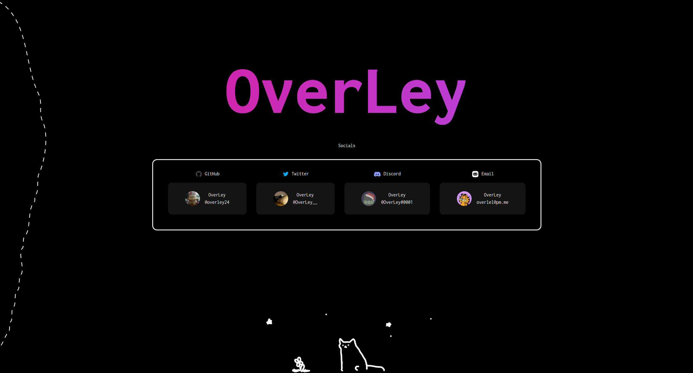
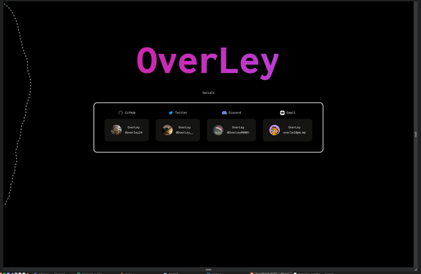
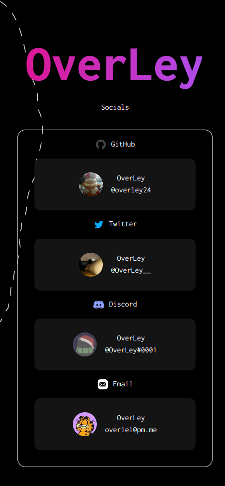
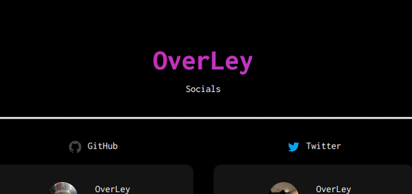
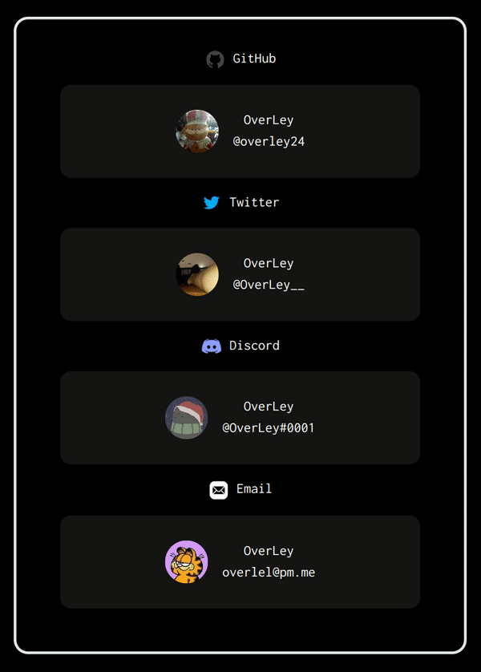
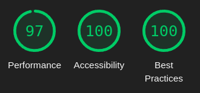

<h1 align="center"> Personal Website </h1>


<p align="center">Svelte Kit • Tailwind • animejs</p>
<p align="center">deployed with deno</p>
<p align="center">
  <a href="https://overley.dev"><strong>overley.dev</strong></a>
</p>
  
<h1>Features</h1>

- #### Fully responsive (**PC, Tablet, Mobile**)
<br/>

<br/>

##### Mobile


- #### Animations (**header, social hover, svg line, eastereggs**)

<br/>


<details>
  <summary>Line</summary>

</details>

<br/>

- ### Easter eggs
    <details>
      <summary>SPOILER!</summary>

      - click the cat (for shooting star animation)

      - press <kbd>C</kbd> now the side spin one time

      - press <kbd>F12</kbd> and look in the console section with your webbrowser dev tools (you should see a cat and stars in ASCII)
    </details>

<br/>

## Installation

#### requirements

- node 16+ (<kbd>v19.2.0</kbd>)
- npm (<kbd>v8.19.2</kbd>)


### Install the repository on your local device

```console
$ git clone https://github.com/OverLey42/personal-website
$ cd personal-website
```

### Install the projekt (packages)

```console
$ npm i
```

### Start the website

```console
$ npm run dev
```
Website: [localhost](http://localhost:5173/))

<br/>

## Site Performance
##### google lighthouse (desktop test)


<br/>

## Rsources

##### Tailwind:

- Gradient hover animation effect [this](https://github.com/OverLey42/personal-website/edit/main/README.md#animations-header-social-hover-svg-line-eastereggs): https://play.tailwindcss.com/XFQDCOKQ8L

##### Ascii art:

- stars: https://gist.github.com/macu/8240d2f44db4d3cc5975
- cat: http://www.ascii-art.de/ascii/c/cat.txt
